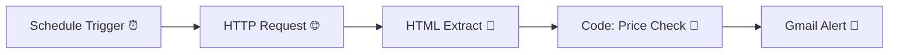

# 📉 Amazon MacBook Price Tracker (n8n Workflow)

This workflow automatically **tracks the price of a MacBook on Amazon** and alerts you via **Gmail** when the price changes.  

Built with [n8n](https://n8n.io), it runs on a schedule and leverages **ScraperAPI** to fetch product details reliably.  

---

## 🚀 Features
- ⏱ Runs automatically every 2 hours (configurable).  
- 🌐 Scrapes product details from Amazon using **ScraperAPI**.  
- 🔍 Extracts price and ASIN from the product page.  
- 💸 Compares the current price against a predefined threshold (`₹110,000`).  
- 📧 Sends a **Gmail alert** if the price condition is met.  

---

## 🛠 Prerequisites
Before you run this workflow, you’ll need:
1. **n8n instance** (self-hosted or cloud).  
2. A [ScraperAPI](https://www.scraperapi.com/) account + API key.  
3. A Gmail account connected to n8n (OAuth2 credentials).  

---

## ⚙️ Setup Instructions
1. **Import Workflow**  
   - Upload the `workflow.json` into your n8n instance.  

2. **Add Your API Key**  
   - In the `HTTP Request` node, replace:  
     ```
     https://api.scraperapi.com/?api_key=<SCRAPER_API_KEY>&url=...
     ```  
     with your actual API key.  

3. **Configure Gmail**  
   - In the `Gmail` node, replace `<YOUR_EMAIL>` with your recipient email.  
   - Make sure Gmail credentials are properly connected in n8n.  

4. **Adjust Threshold (optional)**  
   - Open the `Code` node.  
   - Change this line if you want a different price trigger:  
     ```js
     const threshold = 110000; // update this to your target price
     ```  

5. **Run or Schedule**  
   - The workflow comes with a **Schedule Trigger** set to run every 2 hours.  
   - Adjust as needed.  

---

## 🗺 Workflow Overview


---

## 📬 Example Alert Email
```
Subject: Price Alert: MacBook

The current price is ₹1,09,990.00
ASIN: B0DZD8QJBH
```

---

## 🔒 Security
- Do **not** hardcode your ScraperAPI key or Gmail credentials in the JSON.  
- Instead, use **environment variables** (`$env.SCRAPER_API_KEY`) or n8n’s **Credentials Manager**.  

---

## 🌟 Future Improvements
- Make the threshold configurable via a **Set node**.  
- Allow tracking multiple Amazon products in parallel.  
- Send alerts via WhatsApp/Telegram in addition to Gmail.  

---

## 📌 Disclaimer
This workflow is for **educational and personal use only**.  
Respect Amazon’s [terms of service](https://www.amazon.com/gp/help/customer/display.html?nodeId=508088) when using web scraping tools.  
